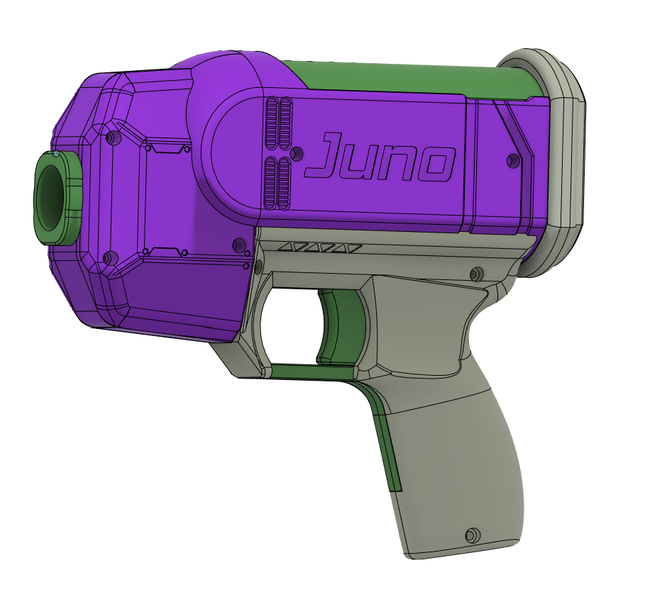

# Juno

Juno is the successor to Jupiter with increased FPS, improved features, and open source nature.
This blaster contains the new OOD Photons and custom-made Rival wheels that fit standard shell profiles.

## Licensing

If you want to print and sell this item, please contact outofdarts@gmail.com.

 This work is licensed under a <a rel="license" href="http://creativecommons.org/licenses/by-nc-sa/4.0/">Creative Commons Attribution-NonCommercial-ShareAlike 4.0 International License</a>.

## Description

* Files can be found in two ways. The major file version can be found zipped together here. The latest release and any beta files can be on this GitHub.

* If you bought the hardware kit, it comes with two versions. The standard hardware contains all hardware for Juno and extra hardware for the Picatinny rails. Holdster Hardware replaces the M3 brass inserts with M5 and holdster magnets. Though not pictured, the installation process is the same. Only the Mag-Battery file needs to be changed.

* The battery is not included with the hardware kit. Most OOD batteries will fit in the large battery tray.

## Reviews

* Waiting for them to come in

### Hardware notes:

Hardware listing:
3D Printed + Hardware listing:
Fully assembled listing:

## Assembly
